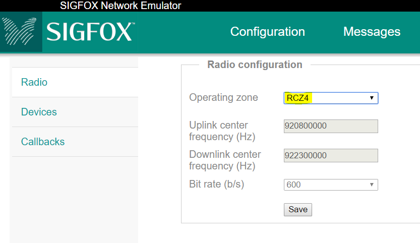
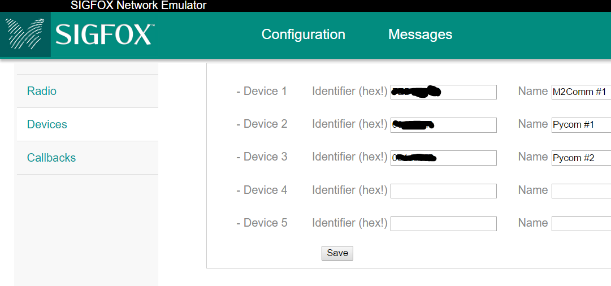
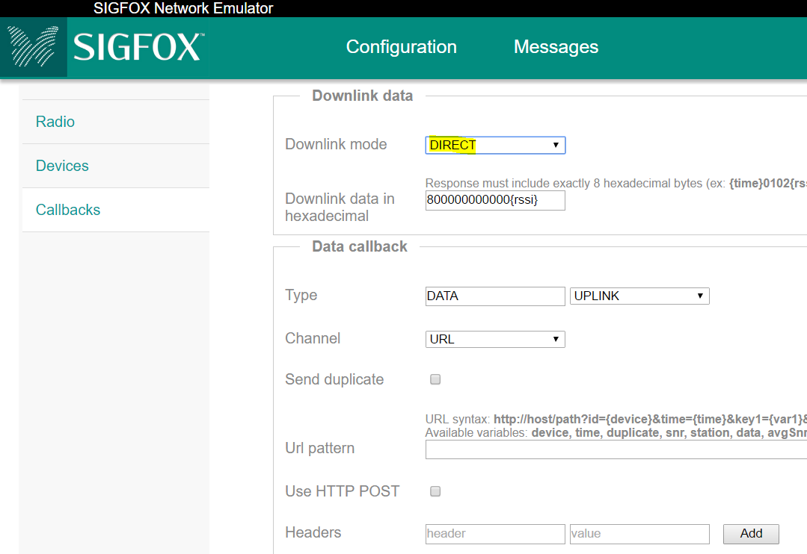
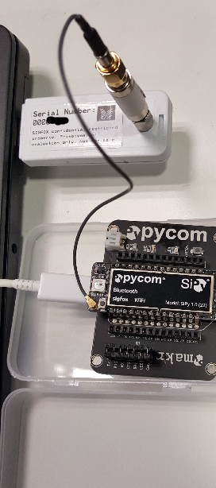
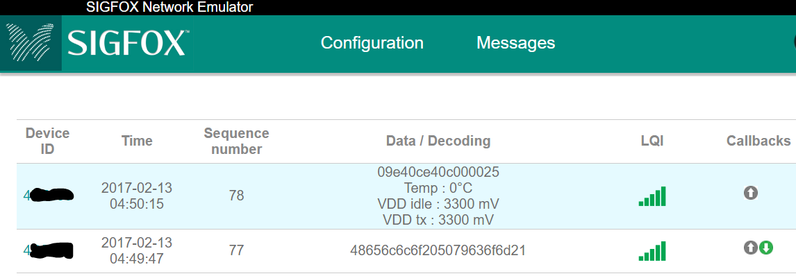

# Getting started with sigfox Network Emulator Kit (SNEK)
This is a step-by-step guide to connect your sigfox dev kit/module/design to the SNEK.
The full setup documentation is available on the support download link: http://www.sigfox.com/support/download

## 1. Requirements
- SNEK hardware including RF cable (SMA or uFL) and attenuator
- Module/Kit to be tested with uFL or SMA connector. Note: The module must implement a function to switch to sigfox public key
- SNEK software: http://www.sigfox.com/support/download (Ubuntu and Win10 versions available)

## 2. Software installation and configuration
Download the software following the link above.
Do not connect the SNEK hardware before completing the software setup. Once installation is finished, you can connect the SNEK to the USB port.

Start the SNEK program, a webpage will open in order to configure the emulator.
In the Radio menu, select the Radio Zone of your device. In the following case we select RCZ4. Frequencies and bitrate are automatically selected.

In the Devices section, add your device ID and a label to it:

Finally you can configure callbacks for downlink messages. In our setup below we configured a fixed downlink payload including the RSSI level:

## 3. Hardware connection to the devkit
Add the attenuator and RF cable between the SNEK and your device as below. The attenuator is required in order to limit the received power on the SNEK:

## 4. Public Key setup and message reception
Configure your dev kit to use the sigfox public key. This is mandatory otherwise messages won't be decoded by the SNEK.
Configuring the public key can usually be done through an AT command or through a function in the SDK, refer to the supplier's datasheet. Note that some manufacturers may not implement this function.

In our example using a SiPy kit, we use the following commands to define our RCZ4 and public key:
`sigfox = Sigfox(mode=Sigfox.SIGFOX, rcz=Sigfox.RCZ4)
sigfox.public_key(True)`

Finally send a sigfox message and verify in the Messages menu that it has been received:

If a downlink has been configured and properly received by the device, a green arrow will appear in the Callbacks column.
